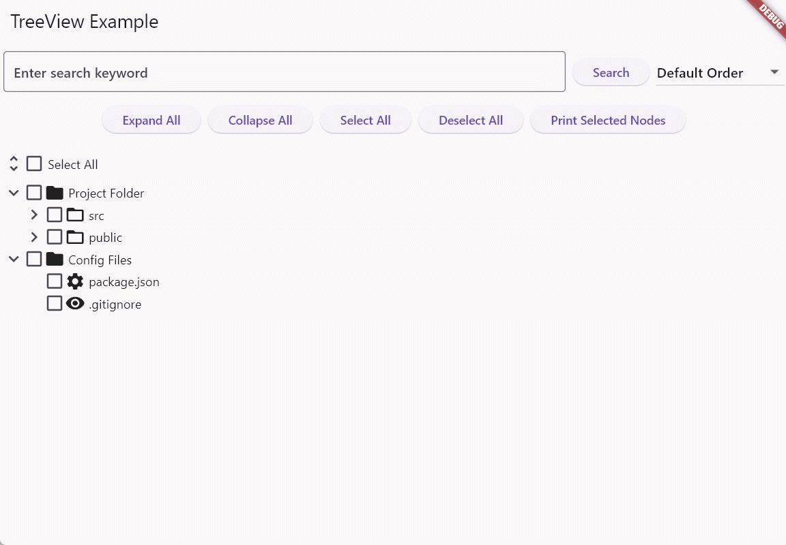

# TreeView

[](https://pub.dev/packages/treeview)
[](https://pub.dev/packages/treeview)
[](https://github.com/monkeyWie/flutter_treeview/blob/main/LICENSE)

A customizable and feature-rich tree view widget for Flutter.

## Screenshot



## Features

- Hierarchical data display
- Node selection with multi-select support
- Expandable/collapsible nodes
- Filtering and sorting capabilities
- Customizable node appearance
- "Select All" functionality
- Expand/Collapse all nodes option

## Getting Started

To use the TreeView widget in your Flutter project, follow these steps:

```
flutter pub add treeview
```

## Usage

Here's a basic example of how to use the TreeView widget:

```dart
import 'package:flutter/material.dart';
import 'package:treeview/treeview.dart';

void main() {
  runApp(MyApp());
}

class MyApp extends StatelessWidget {
  @override
  Widget build(BuildContext context) {
    return MaterialApp(
      home: Scaffold(
        appBar: AppBar(
          title: Text('TreeView Example'),
        ),
        body: TreeView<String>(
          nodes: [
            TreeNode(
              label: 'Root',
              value: 'root',
              children: [
                TreeNode<String>(label: 'Child 1', value: 'child1'),
                TreeNode<String>(label: 'Child 2', value: 'child2'),
              ],
            ),
          ],
          onSelectionChanged: (selectedValues) {
            print('Selected values: $selectedValues');
          },
        ),
      ),
    );
  }
}
```

## Customization

The TreeView widget offers various customization options:

- `showSelectAll`: Enable/disable the "Select All" checkbox
- `selectAllWidget`: Custom widget for the "Select All" option
- `showExpandCollapseButton`: Show/hide expand/collapse buttons
- `initialExpandedLevels`: Set the initial number of expanded levels

For more advanced customization, refer to the API documentation.

## Advanced Features

### Filtering

To implement filtering, use the `filter` method of the `TreeViewState`:

```dart

final treeViewKey = GlobalKey<TreeViewState<String>>();

treeViewKey.currentState?.filter('search keyword');
```

### Sorting

To implement sorting, use the `sort` method of the `TreeViewState`:

```dart
final treeViewKey = GlobalKey<TreeViewState<String>>();

treeViewKey.currentState?.sort((a, b) => a.label.compareTo(b.label));
```

### Set Select All

To set the select all state, use the `setSelectAll` method of the `TreeViewState`:

```dart
final treeViewKey = GlobalKey<TreeViewState<String>>();

treeViewKey.currentState?.setSelectAll(true);
```

### Expand/Collapse All

To expand or collapse all nodes, use the `expandAll` and `collapseAll` methods of the `TreeViewState`:

```dart
final treeViewKey = GlobalKey<TreeViewState<String>>();

treeViewKey.currentState?.expandAll();
treeViewKey.currentState?.collapseAll();
```

### Get Selected Nodes

To get the selected nodes, use the `getSelectedNodes` method of the `TreeViewState`:

```dart
final treeViewKey = GlobalKey<TreeViewState<String>>();

final selectedNodes = treeViewKey.currentState?.getSelectedNodes();
```

### Get Selected Values

To get the selected values, use the `getSelectedValues` method of the `TreeViewState`:

```dart
final treeViewKey = GlobalKey<TreeViewState<String>>();

final selectedValues = treeViewKey.currentState?.getSelectedValues();
```

## Contributing

Contributions are welcome! Please feel free to submit a Pull Request.

## License

This project is licensed under the MIT License - see the [LICENSE](LICENSE) file for details.
